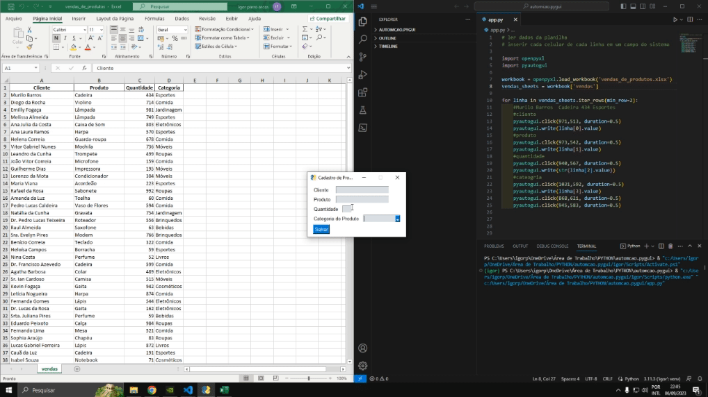

# Automação de um Sistama de Preenchimento Manual 

## Sobre o projeto

Automação de um Sistama de preenchimento manual é uma aplicação back-and Python, construída para estudo e portifólio, baseado em cursos que venho fazendo.

A aplicação consiste em uma Automação para preenchimento de um suposto sistema. Que  consiste em pegar informações de uma tabela Excel.xlsx e inserir esses dados em um possivel sistema de uma empresa. 

Essa automação consiste em um sistema para reduzir trabalhos manuais resultando em uma automação de processos manuais.

    

# Tecnologias utilizadas
## Back end
- Python
- bibliotecas python: import openpyxl; import pyautogui; import PySimpleGUI

# Como executar o projeto

## Back end
Pré-requisitos: possuir Python instalado em sua maquina, e suas devidas blibiotecas: import openpyxl; import pyautogui; import PySimpleGUI

## Execução
Consiste em dois Apps, o primeiro app é onde possui o codigo de automação. O app2 é onde possui o painel ficticio que simula o sistema que seria inserido os dados. recomendo rodar em abas diferentes!
# Autor

Igor Parro Arcas 

https://www.linkedin.com/in/igor-parro-arcas/
